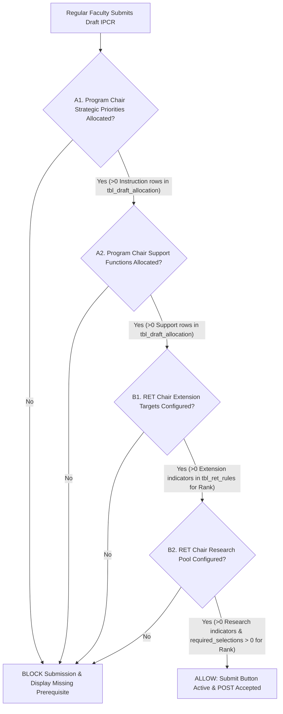

# Implementation Plan: Regular Faculty Draft IPCR Submission Gating

## 1. Problem Statement & Background
In the current system, a regular faculty member can access their dashboard and click **"Submit IPCR for Review"** / **"Submit IPCR for Approval"** even when:
1. The **Program Chair** has not allocated any Strategic Priority (Instruction) or Support Function targets for their specialization/department.
2. The **RET Chair** has not configured Research and Extension target rules for their academic rank band.

When this occurs:
- The system synthesizes only the mandatory default **Teaching Load** target (`f'tl_{tl_ind_id}'`).
- Because no Research rules exist, the system evaluates `is_faculty_ret_eligible(...)` to `False`, immediately sets the draft status to `'Waiting for Approval'`, and completely bypasses the RET review lane.
- Extension targets are not populated (0 rows inserted).
- The transaction commits, delivering a crippled, single-item IPCR directly to the Program Chair.

This feature introduces a strict gating mechanism ensuring regular faculty can only submit their draft IPCR when both the Program Chair and RET Chair have completed their respective baseline allocations and rank configurations.

---

## 2. Gating Criteria Specification

For a faculty member with `designation = 'Regular Faculty'`, draft submission is permitted **only** when all four prerequisites are satisfied for the active academic term:



### Condition A: Program Chair Departmental Target Allocation
- **A1. Strategic Priorities (Instruction)**: At least one indicator with `tc.slug = 'instruction'` (or `tc.category_name = 'A. Instructions'`) must exist in `tbl_draft_allocation` for `emp_id` (or their specialization) with `assigned_quantity > 0` for the active term.
  - *Note*: The system default Teaching Load is synthesized dynamically and is *not* present in `tbl_draft_allocation`, ensuring it cannot falsely satisfy this check.
- **A2. Support Functions**: At least one indicator with `tc.slug = 'support'` (or `tc.category_name = 'Support Functions'`) must exist in `tbl_draft_allocation` for `emp_id` (or their specialization) with `assigned_quantity > 0` for the active term.

### Condition B: RET Chair Rank Band Configuration
- **B1. Extension Targets**: At least one indicator with `tc.slug = 'extension'` must be configured in `tbl_ret_rules` and `tbl_ret_rule_indicators` for `rank_band(academic_rank)` in the active term (ensuring the faculty member receives their mandatory rank-band extension targets).
- **B2. Research Target Pool**: At least one indicator with `tc.slug = 'research'` and `required_selections > 0` must be configured in `tbl_ret_rules` and `tbl_ret_rule_indicators` for `rank_band(academic_rank)` in the active term (ensuring the faculty member receives their optional research selection pool).

### Key Rules & Scoping
1. **Regular Faculty Scope**: Applies strictly to users where `designation = 'Regular Faculty'`. Designated Faculty (Chairs, Dean, Plain Designated) use different workflows (Dean Studio / College-Wide quotas) and are bypassed by this check.
2. **Resubmission Support**: When a faculty member resubmits after an IPCR is returned/rejected by a reviewer (`is_resubmission = True`), chair allocations and RET rules already exist. The gate does not block resubmissions.

---

## 3. Architecture & Code Impact

### A. Model Layer (`app/models/faculty.py`)

1. **New Helper Function: `check_faculty_draft_gating(cursor, emp_id, term_id)`**:
   - Fetches the employee's `designation`, `academic_rank`, and `specialization`.
   - If `designation != 'Regular Faculty'`, returns `{'can_submit': True, 'missing_reasons': []}`.
   - Evaluates:
     - Program Chair allocations via `tbl_draft_allocation` joined with `tbl_master_indicators` and `tbl_target_categories` for `emp_id` and `term_id`.
     - RET Chair configurations via `tbl_ret_rules` and `tbl_ret_rule_indicators` joined with `tbl_master_indicators` and `tbl_target_categories` for `rank_band(academic_rank)` and `term_id`.
   - Returns a structured dictionary:
     ```python
     {
         'can_submit': bool,
         'has_chair_instruction': bool,
         'has_chair_support': bool,
         'has_ret_extension': bool,
         'has_ret_research': bool,
         'missing_reasons': list[str]  # Explanations for UI display & flash alerts
     }
     ```

2. **Update `submit_faculty_ipcr(conn, cursor, emp_id, term_id, selected_research_targets)`**:
   - For initial submissions (`not is_resubmission`), invoke `check_faculty_draft_gating()`.
   - If `not gating['can_submit']`, rollback transaction and return:
     `False, "Cannot submit draft IPCR. Prerequisites not met: " + "; ".join(gating['missing_reasons'])`.

### B. Route Layer (`app/routes/faculty.py`)

1. **In `faculty_dashboard()`**:
   - When an `active_term` is present, call `check_faculty_draft_gating(cursor, emp_id, term_id)`.
   - Pass `gating_status` to `render_template('faculty_dashboard.html', ..., gating_status=gating_status)`.

2. **In `faculty_submit_ipcr()`**:
   - Query `check_faculty_draft_gating(cursor, emp_id, int(term_id))`.
   - If `not gating_status['can_submit']`:
     - Flash a warning message: `"Submission blocked: " + "; ".join(gating_status['missing_reasons'])`, `"warning"`.
     - Redirect to `url_for('faculty.faculty_dashboard')`.

### C. Template Layer (`app/templates/faculty_dashboard.html`)

1. **Prerequisites Status Checklist Banner**:
   - Render an alert card above the submit button when `not has_submitted` and `not gating_status.can_submit`:
     - Alert title: **Draft IPCR Submission Unavailable**
     - Subtext: *Your draft IPCR cannot be submitted until your Program Chair and RET Chair complete baseline target allocations for your department and rank.*
     - Checklist items:
       - Strategic Priorities (Instruction): Program Chair allocation [Ready / Pending]
       - Support Functions: Program Chair allocation [Ready / Pending]
       - Extension Targets: RET Chair configuration for {{ academic_rank }} [Ready / Pending]
       - Research Target Pool: RET Chair configuration for {{ academic_rank }} [Ready / Pending]
2. **Submit Button State**:
   - When `not gating_status.can_submit`, `#submitBtn` is rendered with `disabled` and a descriptive title tooltip.
3. **Client-Side Script Synchronization**:
   - Pass `canSubmitGating = {{ 'true' if gating_status.can_submit else 'false' }}` to JavaScript.
   - Update `updateSelectionCount()` so it respects `canSubmitGating` and does not unconditionally enable `#submitBtn`.

---

## 4. Verification & Testing Steps

1. **Fresh Term / Unallocated Test**:
   - Active term opened, but Program Chair has not allocated targets and RET Chair has not configured rules.
   - Verify regular faculty sees the Prerequisites Status Card showing all 4 items `Pending`.
   - Verify `#submitBtn` is disabled.
   - Verify direct POST to `/faculty/submit_ipcr` is rejected with flash warning.
2. **Partial Allocation Tests**:
   - Program Chair allocates Instruction only $\rightarrow$ Support remains `Pending`, button remains disabled.
   - Program Chair allocates Support $\rightarrow$ Both Program Chair items become `Ready`.
   - RET Chair configures Extension only $\rightarrow$ Research pool remains `Pending`, button remains disabled.
   - RET Chair configures Research pool $\rightarrow$ All 4 items become `Ready`.
3. **Submission Acceptance Test**:
   - Once all 4 prerequisites are `Ready`, the alert banner clears/shows Ready status, `#submitBtn` enables, and clicking it submits the draft for review.
4. **Returned/Rejected IPCR Resubmission**:
   - Program Chair or RET Chair returns an IPCR for corrections.
   - Verify faculty can adjust choices and resubmit without gating interference.
5. **Designated Faculty Integrity**:
   - Verify Plain Designated Faculty and Chairs are not blocked by the regular faculty submission gate.
