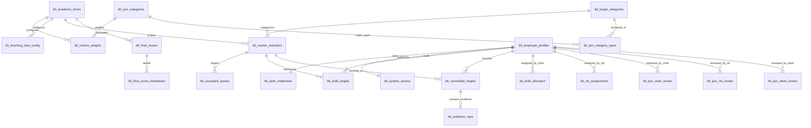
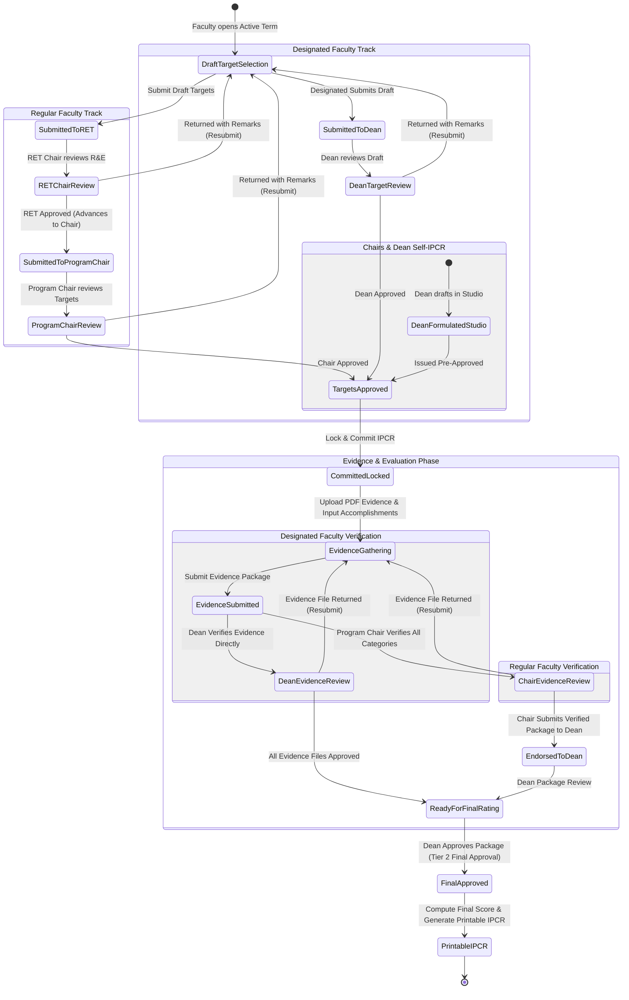
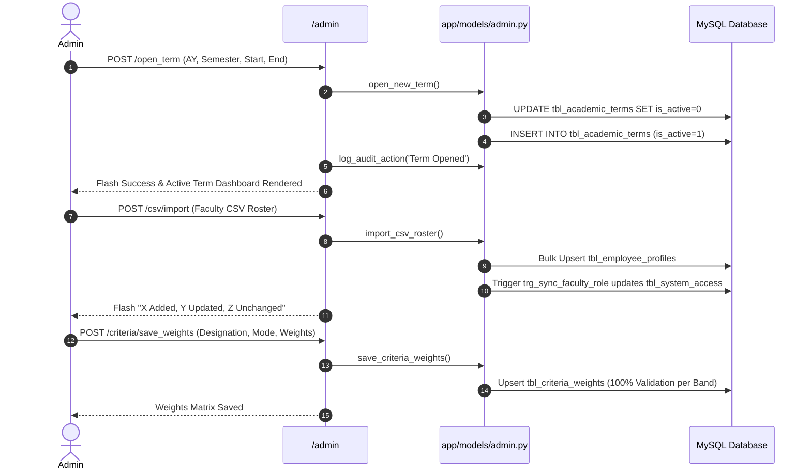
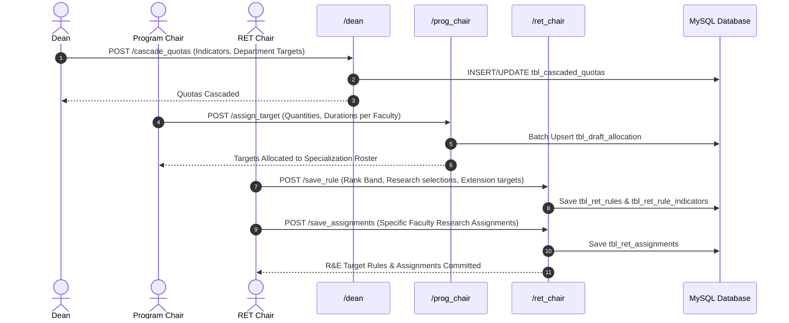
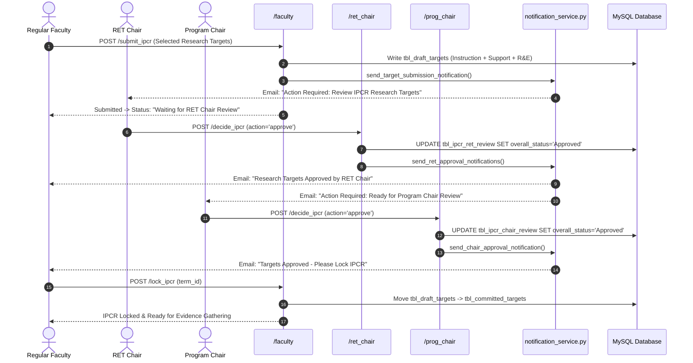
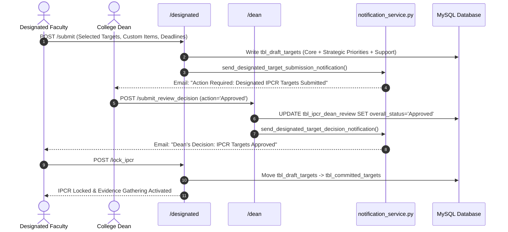
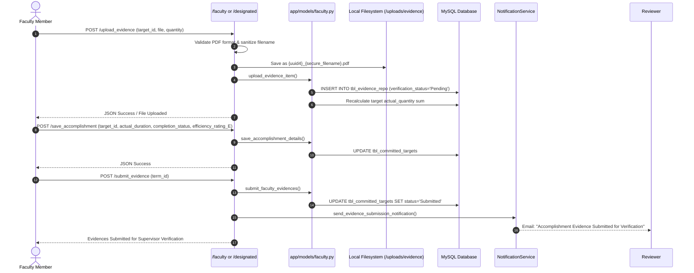
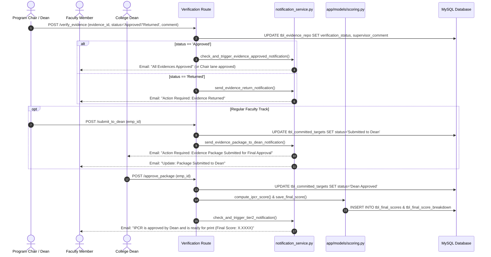
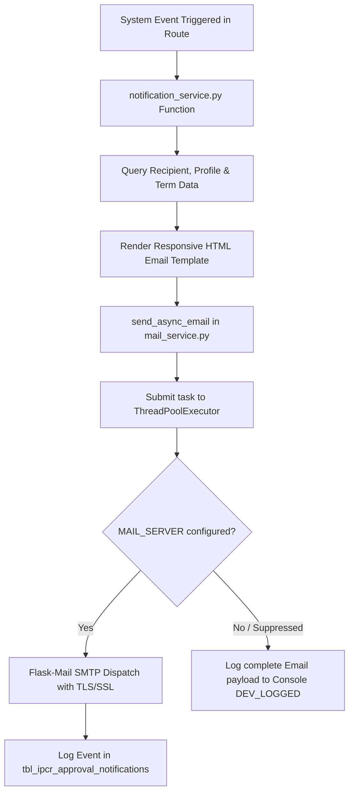

# D-IPCR System Architecture & End-to-End Workflow Specification

**System Name:** Digital Individual Performance Commitment and Review (D-IPCR) Management System  
**Architecture Classification:** Modular Flask MVC with Connection Pooling, Dynamic State Engine, Dual-Track IPCR Lifecycle, and Asynchronous Event-Driven Notifications.

---

## 1. Executive Architecture Overview

The **D-IPCR System** automates, governs, scores, and audits the complete lifecycle of academic and administrative performance commitments in accordance with the Philippine Civil Service Commission Strategic Performance Management System (**SPMS**).

```
┌────────────────────────────────────────────────────────────────────────────────────────┐
│                                    PRESENTATION LAYER                                  │
│  Jinja2 Dashboards (Admin, Dean, Program Chair, RET Chair, Faculty, Designated)        │
│  Modals, Dynamic Filters, Real-time AJAX Endpoints, Formatted IPCR Print Engine        │
└─────────────────────────────────────────┬──────────────────────────────────────────────┘
                                          │ HTTP Requests / Form POST / AJAX JSON
                                          ▼
┌────────────────────────────────────────────────────────────────────────────────────────┐
│                                    ROUTING BLUEPRINTS                                  │
│  /auth          /admin         /faculty        /designated                             │
│  /prog_chair    /ret_chair     /dean           /evidence_uploads                       │
└───────────────────┬─────────────────────────────────────┬──────────────────────────────┘
                    │                                     │
                    ▼                                     ▼
┌──────────────────────────────────────┐  ┌──────────────────────────────────────────────┐
│            BUSINESS LOGIC            │  │             ASYNC EVENT SERVICES             │
│  - Criteria & Weight Matrices        │  │  mail_service.py (ThreadPoolExecutor)        │
│  - Dynamic State Evaluator           │  │  notification_service.py                     │
│  - SPMS Mathematical Scoring Engine  │  │  - 8 Multi-Tier Email Pipelines              │
│  - Token Interpolation & Templates   │  │  - HTML Jinja Email Renderer                 │
│  - Role & Designation Access Guards  │  │  - Non-blocking Background Queue             │
└───────────────────┬──────────────────┘  └──────────────────────────────────────────────┘
                    │
                    ▼
┌────────────────────────────────────────────────────────────────────────────────────────┐
│                                   PERSISTENCE LAYER                                    │
│  MySQL Database (ipcr_db) via MySQLConnectionPool (5 pooled connections, auto-teardown)│
│  22 Relational Tables, Foreign Key Constraints, Cascading Rules, Audit Trails          │
└────────────────────────────────────────────────────────────────────────────────────────┘
```

### 1.1 Core System Roles & Accountability Personas

| Role Code | System Role Name | Functional Scope & Accountability |
| :--- | :--- | :--- |
| `ADMIN` | **System Administrator** | Master governance, term configuration, roster sync, master indicators, criteria weights, teaching load configuration, signatories, database backup, security lockouts. |
| `DEAN` | **College Dean** | College-wide quota cascading, College-Wide target assignment, Designated Faculty draft IPCR studio review/issuance, evidence verification for designated personnel, final Tier 2 approval, college accomplishment oversight. |
| `PROGRAM_CHAIR` | **Program Chairperson** | Specialization target allocation, regular faculty draft IPCR verification (Step 2), regular faculty evidence approval across all categories, package endorsement to Dean. Has an individual IPCR via the Designated track. |
| `RET_CHAIR` | **Research & Extension Chair** | Rank-band research/extension rules, individual research target assignments, regular faculty research target review (Step 1). Has an individual IPCR via the Designated track. |
| `FACULTY` | **Regular Faculty** | Research target self-selection, draft IPCR submission, IPCR lock & commit, PDF evidence upload, accomplishment metadata reporting, IPCR printable generation. |
| `DESIGNATED_FACULTY` | **Designated Faculty / Officer** | Teaching load + administrative function management, custom target authoring, direct submission to Dean, accomplishment evidence upload, printable IPCR generation. |

---

## 2. Relational Data Model & Entity Domain

The system runs on **MySQL (`ipcr_db`)** utilizing InnoDB with foreign key integrity, auto-recovery pools, and stored procedures for critical onboarding.



### 2.1 Key Relational Entities

1. **Authentication & Profile Subsystem:**
   - `tbl_employee_profiles`: Master faculty/admin records (rank, department, designation, specialization).
   - `tbl_auth_credentials`: Corporate email, bcrypt password hash, verification status.
   - `tbl_system_access`: System role mapping and active/inactive status.
   - `trg_sync_faculty_role`: MySQL trigger synchronizing `designation` edits directly to `tbl_system_access.system_role`.

2. **Indicators, Cascades & Allocations Subsystem:**
   - `tbl_target_categories`: Target groupings (Instruction, Research, Extension, Strategic Priorities, Support).
   - `tbl_ipcr_categories` & `tbl_ipcr_category_types`: Configurable weighted criteria groups for Regular vs. Designated Faculty.
   - `tbl_master_indicators`: Term-scoped success indicators with efficiency types (`Output-Based`, `Client Satisfaction`, `Adjectival`).
   - `tbl_cascaded_quotas`: College Dean targets distributed to departments, RET, and College-Wide.
   - `tbl_draft_allocation`: Program Chair target shares distributed to specialization faculty.
   - `tbl_ret_rules` & `tbl_ret_rule_indicators`: Rank-based Research selection rules and mandatory Extension targets.
   - `tbl_ret_assignments`: Specific individual research tasks assigned by RET Chair.

3. **Performance Target Life-Cycle & Review Subsystem:**
   - `tbl_draft_targets`: Pre-commitment proposed targets (`Pending Review`, `Returned`, `Approved`).
   - `tbl_ipcr_ret_review` & `tbl_ipcr_ret_review_items`: RET Chair Review records.
   - `tbl_ipcr_chair_review` & `tbl_ipcr_chair_review_items`: Program Chair Review records.
   - `tbl_ipcr_dean_review` & `tbl_ipcr_dean_review_items`: Dean Review records for designated faculty.
   - `tbl_committed_targets`: Frozen evaluation targets once locked (`Draft`, `Submitted`, `Verified`, `Submitted to Dean`, `Dean Approved`).

4. **Accomplishment, Evidence & Scoring Subsystem:**
   - `tbl_evidence_repo`: PDF evidence uploads, quantity claimed (`actual_qty_Q`), verification status (`Pending`, `Approved`, `Returned`), supervisor feedback.
   - `tbl_final_scores`: Persistent summary scores, adjectival ratings (`Outstanding`, `Very Satisfactory`, `Satisfactory`, `Unsatisfactory`, `Poor`), and Dean approval flags.
   - `tbl_final_score_breakdown`: Category-level weighted rating components.
   - `tbl_ipcr_approval_notifications`: Audit history preventing duplicate email alerts.

---

## 3. End-to-End Workflow State Machine



---

## 4. Detailed Step-by-Step User Action & System Response Mapping

### Phase 0: System Initialization & Governance (Administrator)



#### Detailed Action-Response Matrix:
1. **Open Academic Term (`POST /admin/open_term`):**
   - **User Action:** Enters consecutive academic years (e.g. `2025 - 2026`), selects semester, sets period start/end dates.
   - **System Response:** Deactivates all existing terms, inserts new active term (`is_active = 1`), records log in `tbl_audit_logs`.
2. **Faculty Roster Onboarding (`POST /admin/csv/import` or `/faculty/save`):**
   - **User Action:** Uploads CSV roster or saves single profile.
   - **System Response:** Parses employee numbers, names, ranks, programs, designations. Executes database trigger `trg_sync_faculty_role` which creates or synchronizes `tbl_system_access.system_role`.
3. **Master Indicators Management (`POST /admin/indicators/add`, `/edit`, `/delete`, `/import`):**
   - **User Action:** Configures term success indicators with template syntax (e.g. `{qty:1} classes conducted for {duration:6:months}`).
   - **System Response:** Persists indicators linked to `category_id` and `term_id`.
4. **Criteria Weights & Teaching Load Setup (`POST /admin/criteria/save_weights`, `/teaching_load/save`):**
   - **User Action:** Sets weight percentages (must total exactly 100%) and required teaching hours (e.g., 21 hrs for regular, 10 hrs for designated).
   - **System Response:** Validates mathematical integrity and persists into `tbl_criteria_weights` and `tbl_teaching_load_config`.
5. **Signatory Setup (`POST /admin/signatories/save`):**
   - **User Action:** Defines `REVIEWED_BY`, `APPROVED_BY`, `ASSESSED_BY`, `FINAL_RATING_BY` dynamically or fixed.

---

### Phase 1: Quota Cascading & Allocation (Dean & Chairs)



#### Detailed Action-Response Matrix:
1. **Dean Quota Cascading (`POST /dean/cascade_quotas`):**
   - **User Action:** Dean specifies numerical targets for each department (e.g., BSDS, BSIT), RET, and College-Wide.
   - **System Response:** Stores rows in `tbl_cascaded_quotas`. Toggles `allow_chair_allocation` flag.
2. **Program Chair Target Allocation (`POST /prog_chair/assign_target`):**
   - **User Action:** Chair distributes cascaded departmental quotas to individual faculty members with deadlines and custom descriptions.
   - **System Response:** Writes allocations into `tbl_draft_allocation` for every faculty member in the specialization.
3. **RET Chair Rule & Target Setup (`POST /ret_chair/save_rule`, `/save_assignments`):**
   - **User Action:** Configures rank-band rules (required research selections), locks mandatory Extension indicators, and assigns individual research projects.
   - **System Response:** Records rule indicators in `tbl_ret_rule_indicators` and individual assignments in `tbl_ret_assignments`.
4. **Dean Draft IPCR Studio for Chairs/Dean (`POST /dean/save_designated_assignments`):**
   - **User Action:** Dean configures Core Functions (Instruction) + Strategic Priorities & Support Functions (Departmental Oversight & College-Wide targets) for Chairs and Dean.
   - **System Response:** Executes `save_and_issue_designated_draft_ipcr()`. Automatically creates pre-approved draft targets in `tbl_draft_targets` and marks `tbl_ipcr_dean_review` as `Approved`. Dispatches decision notification email to Chair.

---

### Phase 2: Target Drafting, Review & Approval

#### Track A: Regular Faculty IPCR Workflow



##### Detailed Review Actions:
- **Faculty Submit (`POST /faculty/submit_ipcr`):**
  - Gating checks: Teaching load present, Chair allocations distributed.
  - Generates `tbl_draft_targets`.
  - Determines routing: If research targets exist, routes to **RET Chair**; otherwise routes directly to **Program Chair**.
- **RET Chair Decision (`POST /ret_chair/decide_ipcr`):**
  - **Approve:** Updates status in `tbl_ipcr_ret_review`. Advances overall status to `waiting_for_program_chair_review`. Dispatches approval notification to faculty and chair review request to Program Chair.
  - **Reject / Return:** Requires mandatory remarks. Updates `tbl_draft_targets.review_status = 'Returned'`. Dispatches `send_return_notification()` with itemized modifications.
- **Program Chair Decision (`POST /prog_chair/decide_ipcr`):**
  - **Approve:** Updates `tbl_ipcr_chair_review.overall_status = 'Approved'`. Sends email instructing faculty to Lock IPCR.
  - **Reject / Return:** Sets draft targets to `Returned`. Dispatches `send_return_notification()`.
- **Lock IPCR (`POST /faculty/lock_ipcr`):**
  - Validates Chair approval.
  - Copies approved draft rows into `tbl_committed_targets` with status `Draft`.
  - Unlocks Evidence Management dashboard.

---

#### Track B: Designated Faculty & Officers Workflow



---

### Phase 3: Evidence Gathering, Accomplishment Entry & Submission



#### Accomplishment Text Dynamic Interpolation Engine:
When viewing accomplishments, `build_actual_accomplishment()` dynamically reconstructs the exact sentence from the target template:
$$\text{Sentence} = \text{Target Template}(\text{Actual Quantity}, \text{Actual Duration}, \text{Efficiency Rating})$$
*Example:*
- **Target:** *"Teach 21 hours of classes within 6 months with Satisfactory rating"*
- **Accomplishment:** *"Taught 21 hours of classes within 5 months with Very Satisfactory rating"*

---

### Phase 4: Evidence Verification, Package Endorsement & Final Rating



---

## 5. Mathematical Scoring & Rating Engine (SPMS Standard)

The scoring engine implements strict half-up two-decimal rounding (`Decimal.quantize(ROUND_HALF_UP)`) to ensure exact alignment with manual Civil Service audits.

### 5.1 Sub-Score Formulations

```
1. Quantity Rating (Q):
   Achievement Ratio: RQn = Actual Quantity / Target Quantity
   - RQn >= 1.30  -->  Q = 5
   - RQn >= 1.15  -->  Q = 4
   - RQn >= 1.00  -->  Q = 3
   - RQn >  0.50  -->  Q = 2
   - RQn <= 0.50  -->  Q = 1

2. Efficiency Rating (E):
   - Client Satisfaction: Reported direct score from 1 to 5
   - Adjectival Standard: If RQn >= 1.00 --> E = 5; else ratio-based
   - Output-Based:
       * RQn >= 1.00  -->  E = 5
       * RQn >  0.50  -->  E = 2
       * RQn <= 0.50  -->  E = 1

3. Timeliness Rating (T):
   Timeliness Ratio: RT = 1 - (Actual Time / Target Time)
   - Completion Status Overrides:
       * NOT_BEGUN            -->  T = 1
       * PARTIAL_AT_DEADLINE  -->  T = 2
   - Standard RT Scale:
       * RT >= 0.30           -->  T = 5  (30%+ ahead of deadline)
       * RT >= 0.15           -->  T = 4  (15% - 29% ahead)
       * RT >= 0.00           -->  T = 3  (On-time)
       * RT <  0.00           -->  T = 2  (Delivered late)

4. Target Average Rating (A):
   A = Round2( (Q + E + T) / Active Sub-metrics Count )
   (If target has 0 uploaded evidence, Q=0, E=0, T=0, A=0.00)
```

### 5.2 Roll-Up to Final Weighted Rating

```
For each weighted IPCR Category c in Categories:
    Category Raw Average (R_c) = Sum(A_i for i in Category Targets) / Target Count in Category
    Weighted Value (W_c) = R_c * (Category Weight % / 100)

Final Weighted Rating (FWR) = Sum(W_c for all Categories)
```

### 5.3 Adjectival Rating Classification Table

| Final Weighted Rating Range | Adjectival Rating Band | Quality Assessment Descriptor |
| :--- | :--- | :--- |
| **4.7500 – 5.0000** | **Outstanding** | Performance extraordinary; all targets exceeded standards. |
| **3.7500 – 4.7499** | **Very Satisfactory** | Performance exceeded expectations; high competence displayed. |
| **3.0000 – 3.7499** | **Satisfactory** | Met all targeted performance commitments reliably. |
| **2.0100 – 2.9999** | **Unsatisfactory** | Failed to meet significant portions of commitments. |
| **0.0000 – 2.0099** | **Poor** | Substantially failed to deliver required performance outputs. |

---

## 6. Asynchronous Notification & Mail Dispatch Topology

All email dispatches occur asynchronously on background threads via `concurrent.futures.ThreadPoolExecutor(max_workers=3)` to avoid blocking web requests.



### 6.1 Complete Notification Event Matrix

| Event Name | Trigger Condition | Sender Profile | Recipient | Rendered Template |
| :--- | :--- | :--- | :--- | :--- |
| `TARGET_SUBMITTED_REGULAR` | Regular Faculty clicks Submit IPCR | Faculty | RET Chair (Step 1) or Program Chair (Step 2) | `emails/target_submission_notice.html` |
| `RET_APPROVED` | RET Chair approves research selections | RET Chair | Faculty Member & Program Chair | `emails/ret_approved_notice.html` |
| `CHAIR_APPROVED` | Program Chair approves draft targets | Program Chair | Regular Faculty Member | `emails/chair_approved_notice.html` |
| `TARGETS_RETURNED` | RET Chair or Program Chair returns draft | Reviewer | Faculty Member (with adjustments list) | `emails/ipcr_returned.html` |
| `DESIGNATED_TARGETS_SUBMITTED` | Designated Faculty submits draft IPCR | Designated Fac | College Dean | `emails/target_submission_notice.html` |
| `DESIGNATED_DECISION` | Dean Approves/Rejects Designated draft | College Dean | Designated Faculty Member | `emails/designated_target_decision.html` |
| `EVIDENCE_SUBMITTED` | Faculty submits uploaded evidence files | Faculty Member | Program Chair (Regular) or Dean (Designated) | `emails/evidence_submission_notice.html` |
| `EVIDENCE_PACKAGE_TO_DEAN` | Program Chair endorses evidence package | Program Chair | College Dean & Regular Faculty Member | `emails/evidence_package_to_dean.html` |
| `EVIDENCE_APPROVED_CHAIR` | Chair verifies SP&S evidence files | Program Chair | Faculty Member | `emails/chair_evidence_approved.html` |
| `EVIDENCE_APPROVED_RET` | RET Chair verifies R&E evidence files | RET Chair | Faculty Member | `emails/chair_evidence_approved.html` |
| `EVIDENCE_APPROVED_ALL` | All submitted evidence files approved | Verifiers | Faculty Member | `emails/all_evidences_approved.html` |
| `EVIDENCE_RETURNED` | Verifier returns single evidence item | Verifier | Faculty Member (with reviewer comment) | `emails/evidence_returned_notice.html` |
| `TIER2_FINAL_APPROVAL` | Dean gives final package approval | College Dean | Faculty Member (IPCR Owner) | `emails/tier2_final.html` |

---

## 7. Security, Access Control & Safety Guardrails Matrix

```
┌───────────────────────────────────────────────────────────────────────────────────────┐
│                                 SECURITY & ACCESS GUARDS                              │
├──────────────────────────────────────┬────────────────────────────────────────────────┤
│ Mechanism                            │ Architectural Implementation                   │
├──────────────────────────────────────┼────────────────────────────────────────────────┤
│ Role-Based Access Control            │ @role_required('ROLE') decorator               │
│ Designated Multi-Dashboard Access    │ @designated_ipcr_required decorator            │
│ Evidence File Isolation              │ Send_from_directory with UUID4 filename prefix │
│ Direct File Access Ownership Check   │ Owner check on /evidence_uploads/<evidence_id> │
│ Database Connection Safety Net       │ @app.teardown_request returns conn to pool     │
│ Password Policy & Encryption         │ bcrypt hash + salt, policy enforcement regex   │
│ Immutable Audit Trail                │ tbl_audit_logs with remote client IP address   │
│ Atomic Target Freezing               │ Full snapshot migration on Lock IPCR           │
│ SQL Injection Prevention             │ 100% Parameterized queries with timed_query()  │
└──────────────────────────────────────┴────────────────────────────────────────────────┘
```

---

## 8. Summary of Architectural Verification

- **Completeness:** Maps every route endpoint across `auth.py`, `admin.py`, `faculty.py`, `prog_chair.py`, `ret_chair.py`, `dean.py`, and `designated.py`.
- **Data Integrity:** Aligns directly with `db/schema.sql` database constraints, triggers, procedures, and tables.
- **Service Integration:** Accurately reflects background thread execution in `mail_service.py` and event templates in `notification_service.py`.
- **Scoring Precision:** Fully specifies the SPMS mathematical engine implemented in `app/models/scoring.py` and `ipcr_form.py`.
