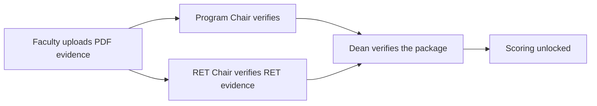

# Dean — Evidence Verification

Faculty upload PDF evidence per committed target; the Program Chair (and RET Chair, where
applicable) verify it first. The Dean verifies the **package** that a chair submits upward.

## Review and verify

1. Go to **Evidence Verification**.
2. Open the faculty member / package awaiting your review.
3. Inspect each evidence file and the accomplishment quantities.
4. **Approve** to verify, or **Return** with a remark so the person can correct it.

## How verification flows

- A target is considered fully verified only when **all** required verifications are done.
- A faculty member with **no RET evidence at all** skips the RET step — nothing to verify —
  so the Program Chair can proceed.

## Tips

- Use the status badges to see at a glance what is pending vs approved.
- Returned evidence keeps the target open; the faculty member re-uploads and the flow repeats.
