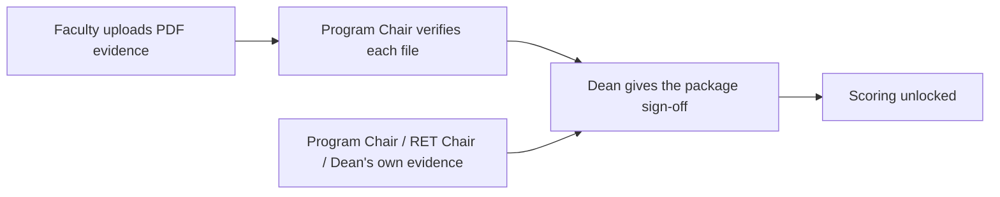

# Dean — Evidence Verification

Faculty upload PDF evidence per committed target. **Regular Faculty and plain Designated
Faculty** evidence is reviewed by the **Program Chair** first; evidence belonging to a
Program Chair, RET Chair or the Dean has no one else to review it, so it reaches you
directly. You then give the **package-level** sign-off.

## Review and verify

1. Go to **Evidence Verification**.
2. Open the faculty member / package awaiting your review.
3. Inspect each evidence file and the accomplishment quantities.
4. **Approve** to verify, or **Return** with a remark so the person can correct it.

## How verification flows

- The **RET Chair does not verify evidence** — not even Research evidence. They only keep a
  read-only monitor of evidence the Program Chair has already approved.
- A package reaches you only once **every** evidence file in it has been reviewed, so you are
  never signing off on a half-reviewed package.
- Approving here marks the targets *Dean Approved* and records the Final Weighted Rating.

## Tips

- Use the status badges to see at a glance what is pending vs approved.
- Returned evidence keeps the target open; the faculty member re-uploads and the flow repeats.
