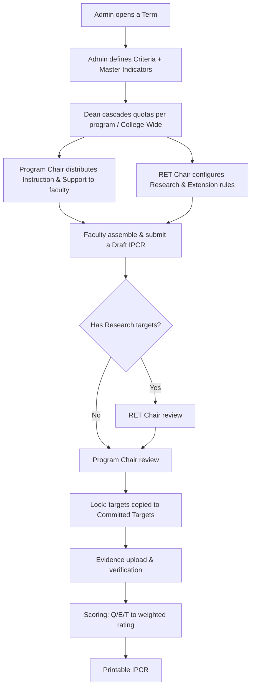

# How the system works (the cascade)

D-IPCR routes performance targets down through the college, then back up through review,
locking, evidence and scoring. Understanding this flow makes every screen make sense.

## The eight phases

1. **Admin opens a term** and defines the master indicators (grouped into criteria).
2. **Dean cascades quotas** — a number for each program, for College-Wide, and for RET.
3. **Program Chair distributes** Instruction and Support quotas to people;
   **RET Chair** configures Research/Extension rules and per-faculty eligibility.
4. **Faculty assemble and submit** their draft IPCR.
5. **Review** — RET-eligible drafts go through the RET Chair first, then the Program Chair;
   everything else goes straight to the Program Chair. The **Dean does not review targets** —
   the Program Chair's approval ends the draft chain.
6. **Lock** — an approved IPCR is locked and copied into committed targets.
7. **Evidence** — PDFs are uploaded per committed target, verified file-by-file by the
   **Program Chair**, then signed off at package level by the **Dean**.
8. **Scoring & print** — Q/E/T ratings roll up into weighted categories and a final
   adjectival rating, then a printable IPCR.

## Two kinds of "role" — an important distinction

- **`system_role`** decides which **dashboard** you land on.
- **`designation`** is your job title (`Regular Faculty`, `Designated Faculty`,
  `Program Chair`, `RET Chair`, `Dean`, `Admin`) and decides **whether you have an IPCR of
  your own** and which weight table scores it.

A Program Chair, RET Chair or Dean is a **designated faculty member**: they use their own
role dashboard *and* have a personal IPCR scored through the shared designated flow.

## Target categories

Indicators belong to a **criterion** (target type). The six built-in slugs are
`instruction`, `research`, `extension`, `support`, `administrative` and `custom`.
The **review lane** on each criterion decides who reviews it:

| Criterion | Review lane |
| --- | --- |
| Instruction | Program Chair |
| Support | Program Chair |
| Administrative | Program Chair |
| Research | RET Chair |
| Extension | RET Chair |

This lane governs the **draft / target review**. Evidence verification is a separate stage:
the Program Chair verifies all regular faculty evidence, and the Dean signs off the package.

## Weights

Two weight tables are used, chosen by your designation type:

- **Regular Faculty:** 50% Strategic Priorities / 40% Core Functions / 10% Support Functions
- **Designated Faculty (incl. chairs & Dean):** 75% Strategic Priorities & Support Functions / 25% Core Functions

The Admin configures these per rank band under **Criteria → Weight Allocation by Rank**.
