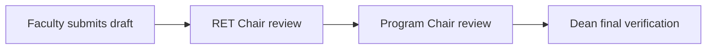

# RET Chair — Commitments

Review the RET (Research / Extension) submissions from faculty. Because Research/Extension
targets route to the **RET** review lane, this review happens **before** the Program Chair's
review.

## Reviewing a submission

1. Open the pending submission.
2. Review each Research/Extension target — description, quantity and duration.
3. Adjust as needed and add remarks.
4. **Approve**, or **Return** to the faculty member for correction.

## Order of review

The RET review only applies to submissions that **contain Research targets**. Submissions
with no Research targets bypass this step and go straight to the Program Chair.

## After approval

An approved submission continues to the Program Chair, then to the Dean's final verification.
